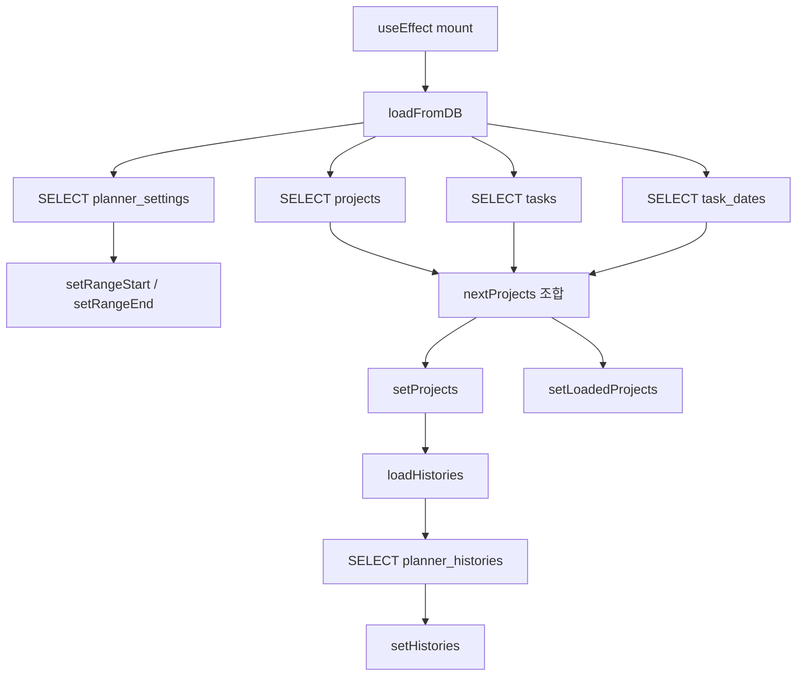
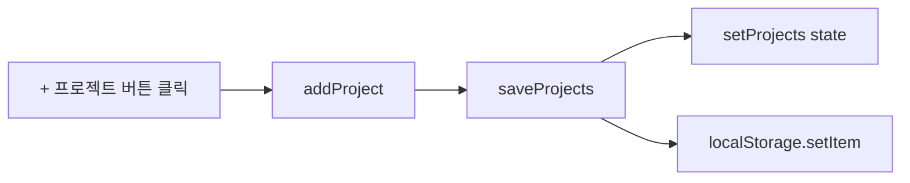
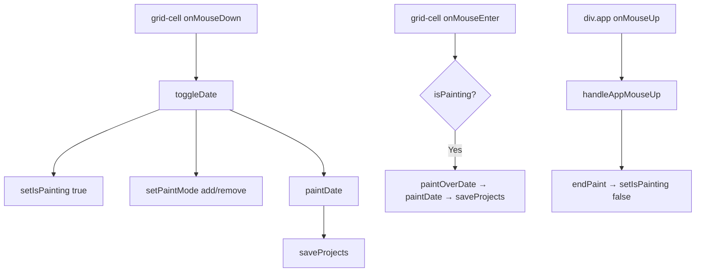
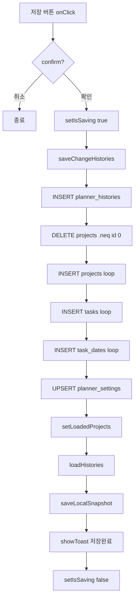

# 기능(Feature Group) 분석 (FeatureAnalysis)

> 분석 대상: `src/App.jsx`  
> 분석 기준: 실제 함수 호출 관계, React State 변경, Supabase 쿼리 흐름  
> 분석 일자: 2026-07-02

---

## Feature 1. 앱 초기화 및 DB 데이터 로드

| 항목 | 내용 |
|------|------|
| **기능명** | 앱 초기화 및 DB 로드 |
| **설명** | 앱 마운트 시 Supabase에서 프로젝트/업무/일정/설정 데이터를 로드하고 localStorage와 state를 동기화함 |
| **시작 함수** | `useEffect([], loadFromDB)` |
| **종료 함수** | `loadHistories` → `setHistories` |
| **사용 함수** | `loadFromDB`, `loadHistories`, `setProjects`, `setLoadedProjects`, `setRangeStart`, `setRangeEnd` |
| **호출 순서** | `useEffect(mount)` → `loadFromDB` → ①`planner_settings` 로드 → ②`projects` 로드 → ③`tasks` 로드 → ④`task_dates` 로드 → `setProjects` → `loadHistories` → `setHistories` |
| **State 변경** | `projects`, `loadedProjects`, `rangeStart`, `rangeEnd`, `selectedRange`, `histories` |
| **관련 UI** | 플래너/대시보드 전체 렌더링 |
| **DB 테이블** | `planner_settings`, `projects`, `tasks`, `task_dates`, `planner_histories` |
| **외부 API** | Supabase SELECT |

---

## Feature 2. 프로젝트 생성

| 항목 | 내용 |
|------|------|
| **기능명** | 프로젝트 생성 |
| **설명** | 빈 프로젝트와 첫 번째 빈 업무를 추가하고 즉시 localStorage에 저장 |
| **시작 함수** | `addProject` |
| **종료 함수** | `saveProjects` |
| **사용 함수** | `addProject`, `saveProjects`, `setProjects` |
| **호출 순서** | `+ 프로젝트 버튼 onClick` → `addProject` → `saveProjects` → `setProjects` + `localStorage.setItem` |
| **State 변경** | `projects` |
| **관련 UI** | 플래너 info-panel, 프로젝트 행 |
| **DB 테이블** | — (DB 저장은 saveAllToDB 시점) |
| **외부 API** | — |

---

## Feature 3. 업무 추가

| 항목 | 내용 |
|------|------|
| **기능명** | 업무 추가 |
| **설명** | 특정 프로젝트에 빈 업무 행을 추가. + 버튼 또는 마지막 셀에서 Tab/Enter 입력 시 발생 |
| **시작 함수** | `addTaskToProject` |
| **종료 함수** | `saveProjects` |
| **사용 함수** | `addTaskToProject`, `moveNextCell`, `saveProjects` |
| **호출 순서** | `(+버튼 또는 Tab/Enter)` → `addTaskToProject` → `saveProjects` |
| **State 변경** | `projects` |
| **관련 UI** | 플래너 task-row-fields |
| **DB 테이블** | — |
| **외부 API** | — |

---

## Feature 4. 업무 정보 편집

| 항목 | 내용 |
|------|------|
| **기능명** | 업무 정보 편집 |
| **설명** | work, title, owner, artifactName, artifactUrls 필드를 인라인 input으로 수정 |
| **시작 함수** | input `onChange` |
| **종료 함수** | `saveProjects` |
| **사용 함수** | `updateTask`, `updateTaskFields`, `updateProjectName`, `saveProjects` |
| **호출 순서** | `onChange` → `updateTask(key, value)` → `saveProjects` |
| **State 변경** | `projects` |
| **관련 UI** | 플래너 table-input, url-modal |
| **DB 테이블** | — |
| **외부 API** | — |

---

## Feature 5. 일정 페인팅 (날짜 드래그 입력)

| 항목 | 내용 |
|------|------|
| **기능명** | 일정 페인팅 |
| **설명** | 타임라인 셀을 클릭/드래그하여 업무 날짜(dates)를 추가/제거. 페인트 모드가 유지되어 드래그 중 연속 적용됨 |
| **시작 함수** | `toggleDate` (onMouseDown) |
| **종료 함수** | `endPaint` (onMouseUp) |
| **사용 함수** | `toggleDate`, `paintDate`, `paintOverDate`, `endPaint`, `isDateSelected`, `saveProjects` |
| **호출 순서** | `onMouseDown` → `toggleDate` → `paintDate` → `saveProjects` → (드래그 중) `onMouseEnter` → `paintOverDate` → `paintDate` → (마우스업) `handleAppMouseUp` → `endPaint` |
| **State 변경** | `isPainting`, `paintMode`, `projects` |
| **관련 UI** | 플래너 grid-cell |
| **DB 테이블** | — |
| **외부 API** | — |

---

## Feature 6. 적색 날짜 토글

| 항목 | 내용 |
|------|------|
| **기능명** | 적색 날짜 토글 |
| **설명** | 셀 더블클릭으로 redDates(위험/중요 날짜) 추가/제거 |
| **시작 함수** | `toggleRedDate` |
| **종료 함수** | `saveProjects` |
| **사용 함수** | `toggleRedDate`, `saveProjects` |
| **호출 순서** | `grid-cell onDoubleClick` → `toggleRedDate` → `saveProjects` |
| **State 변경** | `projects` |
| **관련 UI** | 플래너 grid-cell (red-selected 클래스) |
| **DB 테이블** | — |
| **외부 API** | — |

---

## Feature 7. 셀 메모 입력

| 항목 | 내용 |
|------|------|
| **기능명** | 셀 메모 입력 |
| **설명** | Shift+클릭으로 날짜 셀에 메모를 입력/수정/삭제하는 모달 |
| **시작 함수** | `updateDateMemo` |
| **종료 함수** | `saveProjects` (모달 저장 버튼) |
| **사용 함수** | `updateDateMemo`, `setMemoEditor`, `saveProjects` |
| **호출 순서** | `Shift+onMouseDown` → `updateDateMemo` → `setMemoEditor({...})` → (모달 저장) → `saveProjects` |
| **State 변경** | `memoEditor`, `projects` |
| **관련 UI** | memo-modal |
| **DB 테이블** | — |
| **외부 API** | — |

---

## Feature 8. 문서 URL 관리

| 항목 | 내용 |
|------|------|
| **기능명** | 문서 URL 관리 |
| **설명** | 업무에 문서 링크(1개 이상)를 추가/수정/삭제하는 모달 |
| **시작 함수** | `setUrlEditor` (링크 버튼 onClick) |
| **종료 함수** | `updateTaskFields` (모달 저장) |
| **사용 함수** | `setUrlEditor`, `updateTaskFields`, `saveProjects` |
| **호출 순서** | `링크버튼 onClick` → `setUrlEditor({urls})` → (모달에서 편집) → `저장 onClick` → `updateTaskFields({artifactUrls, artifactUrl})` → `saveProjects` |
| **State 변경** | `urlEditor`, `projects` |
| **관련 UI** | url-modal, url-button |
| **DB 테이블** | — |
| **외부 API** | window.open (URL 열기) |

---

## Feature 9. 업무 상태 변경

| 항목 | 내용 |
|------|------|
| **기능명** | 업무 상태 변경 |
| **설명** | 상태 뱃지 클릭으로 대기→진행→완료 순환 |
| **시작 함수** | `cycleStatus` |
| **종료 함수** | `saveProjects` |
| **사용 함수** | `cycleStatus`, `saveProjects`, `getDisplayStatus` |
| **호출 순서** | `status-pill onClick` → `cycleStatus` → `saveProjects` |
| **State 변경** | `projects` |
| **관련 UI** | status-pill |
| **DB 테이블** | — |
| **외부 API** | — |

---

## Feature 10. 업무 삭제

| 항목 | 내용 |
|------|------|
| **기능명** | 업무 삭제 |
| **설명** | confirm 후 업무 삭제. 마지막 업무 삭제 시 프로젝트도 함께 삭제됨 |
| **시작 함수** | `deleteTask` |
| **종료 함수** | `saveProjects` |
| **사용 함수** | `deleteTask`, `saveProjects` |
| **호출 순서** | `삭제 버튼 onClick` → `confirm` → `deleteTask` → `saveProjects` |
| **State 변경** | `projects` |
| **관련 UI** | delete-btn |
| **DB 테이블** | — |
| **외부 API** | — |

---

## Feature 11. DB 저장 (전체 동기화)

| 항목 | 내용 |
|------|------|
| **기능명** | DB 저장 |
| **설명** | 현재 로컬 데이터를 Supabase에 전체 저장. delete-then-insert 방식. 저장 전 변경 이력도 기록 |
| **시작 함수** | `saveAllToDB` |
| **종료 함수** | `showToast('DB 저장 완료')` |
| **사용 함수** | `saveAllToDB`, `saveChangeHistories`, `loadHistories`, `saveLocalSnapshot`, `showToast` |
| **호출 순서** | `저장 버튼 onClick` → `confirm` → `saveAllToDB` → `saveChangeHistories` (INSERT histories) → DELETE projects → INSERT projects → INSERT tasks → INSERT task_dates → UPSERT planner_settings → `setLoadedProjects` → `loadHistories` → `saveLocalSnapshot` → `showToast` |
| **State 변경** | `isSaving`, `loadedProjects`, `histories`, `localHistory`, `historyIndex` |
| **관련 UI** | 저장 버튼, toast |
| **DB 테이블** | `planner_histories`, `projects`, `tasks`, `task_dates`, `planner_settings` |
| **외부 API** | Supabase DELETE, INSERT, UPSERT |

---

## Feature 12. 로컬 히스토리 (Undo/Redo)

| 항목 | 내용 |
|------|------|
| **기능명** | 로컬 히스토리 (Undo/Redo) |
| **설명** | DB 저장 시점에 스냅샷을 최대 3개 저장, ← → 버튼으로 이전/다음 상태로 복원 |
| **시작 함수** | `saveLocalSnapshot` (저장 시), `moveLocalHistory` (이동 시) |
| **종료 함수** | `applySnapshot` |
| **사용 함수** | `buildSnapshot`, `saveLocalSnapshot`, `moveLocalHistory`, `applySnapshot`, `showToast` |
| **호출 순서** | **저장**: `saveLocalSnapshot` → `buildSnapshot` → `localStorage.setItem(LOCAL_HISTORY_KEY)` / **이동**: `← or → 버튼` → `moveLocalHistory` → `applySnapshot` → state 복원 → `showToast` |
| **State 변경** | `localHistory`, `historyIndex`, `projects`, `rangeStart`, `rangeEnd`, `customHolidayDates` |
| **관련 UI** | ← / → 버튼 |
| **DB 테이블** | — |
| **외부 API** | — |

---

## Feature 13. 순서 변경 (Shift+드래그)

| 항목 | 내용 |
|------|------|
| **기능명** | 순서 변경 |
| **설명** | 잠금 해제 상태에서 Shift+드래그로 프로젝트 또는 업무 순서 변경 |
| **시작 함수** | `onMouseDown` (shift+drag) |
| **종료 함수** | `reorderProject` 또는 `reorderTask` |
| **사용 함수** | `setDragging`, `setDragOver`, `reorderProject`, `reorderTask`, `saveProjects` |
| **호출 순서** | `Shift+onMouseDown` → `setDragging` → `onMouseEnter` → `setDragOver` → `onMouseUp` → `reorderProject/reorderTask` → `saveProjects` |
| **State 변경** | `dragging`, `dragOver`, `projects` |
| **관련 UI** | project-group, task-row-fields, timeline-row (drag-over 클래스) |
| **DB 테이블** | — |
| **외부 API** | — |

---

## Feature 14. 날짜 범위 변경

| 항목 | 내용 |
|------|------|
| **기능명** | 날짜 범위 변경 |
| **설명** | 이번달/최근3개월/최근6개월/+1개월/전체기간 버튼으로 플래너 표시 기간 변경 |
| **시작 함수** | `setRange` 또는 `addOneMonth` |
| **종료 함수** | `updateRange` → `localStorage.setItem` |
| **사용 함수** | `setRange`, `addOneMonth`, `updateRange`, `scrollToCurrentMonth` |
| **호출 순서** | `버튼 onClick` → `setRange(mode)` → `updateRange(start, end)` → `scrollToCurrentMonth` |
| **State 변경** | `selectedRange`, `rangeStart`, `rangeEnd` |
| **관련 UI** | toolbar 버튼, timeline-panel |
| **DB 테이블** | — |
| **외부 API** | — |

---

## Feature 15. 커스텀 휴일 설정

| 항목 | 내용 |
|------|------|
| **기능명** | 커스텀 휴일 설정 |
| **설명** | 헤더 날짜 셀 더블클릭으로 커스텀 휴일 추가/제거 (월말 금요일 제외) |
| **시작 함수** | `toggleCustomHolidayDate` |
| **종료 함수** | `localStorage.setItem` |
| **사용 함수** | `toggleCustomHolidayDate`, `setCustomHolidayDates` |
| **호출 순서** | `day-cell onDoubleClick` → (isLastFridayOfMonth? 중단) → `toggleCustomHolidayDate` → `setCustomHolidayDates` → `localStorage.setItem` |
| **State 변경** | `customHolidayDates` |
| **관련 UI** | day-cell (custom-holiday 클래스), grid-cell (custom-holiday-line 클래스) |
| **DB 테이블** | — |
| **외부 API** | — |

---

## Feature 16. 히스토리 조회 및 이동

| 항목 | 내용 |
|------|------|
| **기능명** | 히스토리 조회 및 이동 |
| **설명** | DB에 저장된 변경 이력을 목록으로 보여주고, 클릭 시 해당 업무로 플래너 이동 |
| **시작 함수** | `loadHistories` |
| **종료 함수** | `focusTask` |
| **사용 함수** | `loadHistories`, `setHistories`, `getHistoryType`, `buildHistorySentence`, `focusHistory`, `focusTask` |
| **호출 순서** | `히스토리 탭 onClick` (→ setPage) → `History` 렌더링 → `history-item onClick` → `focusHistory` → `focusTask` → `setPage('planner')` → 스크롤 |
| **State 변경** | `histories`, `page`, `highlightTaskId` |
| **관련 UI** | history-page, history-item |
| **DB 테이블** | `planner_histories` |
| **외부 API** | — |

---

## Feature 17. 일일 브리핑

| 항목 | 내용 |
|------|------|
| **기능명** | 일일 브리핑 |
| **설명** | 대시보드 첫 방문 시 오늘 날짜의 프로젝트 진도 / 종료임박 업무를 팝업으로 표시. 음성 읽기 지원 |
| **시작 함수** | `useEffect([page])` |
| **종료 함수** | `closeDailyBrief` 또는 `dismissDailyBrief` |
| **사용 함수** | `setShowDailyBrief`, `closeDailyBrief`, `dismissDailyBrief`, `buildSpeechText`, `handleSpeak` |
| **호출 순서** | `setPage('dashboard')` → `useEffect` → (dismissed 확인) → `setShowDailyBrief(true)` → `DailyBrief` 렌더링 → (음성 클릭) `handleSpeak` → `SpeechSynthesisUtterance` |
| **State 변경** | `showDailyBrief`, `speaking` |
| **관련 UI** | daily-brief-modal |
| **DB 테이블** | — |
| **외부 API** | Web Speech API |

---

## Feature 18. 잠금/편집 전환

| 항목 | 내용 |
|------|------|
| **기능명** | 잠금/편집 전환 |
| **설명** | 비밀번호 입력으로 편집 잠금 해제. 잠금 상태에서는 모든 입력/드래그/클릭이 비활성화됨 |
| **시작 함수** | `toggleScheduleLock` |
| **종료 함수** | `setScheduleLocked(false/true)` |
| **사용 함수** | `toggleScheduleLock`, `setScheduleLocked` |
| **호출 순서** | `잠금 버튼 onClick` → `toggleScheduleLock` → `prompt(비밀번호)` → (일치 시) `setScheduleLocked(false)` |
| **State 변경** | `scheduleLocked` |
| **관련 UI** | 모든 입력 필드 disabled, 잠금 버튼 텍스트 |
| **DB 테이블** | — |
| **외부 API** | — |
